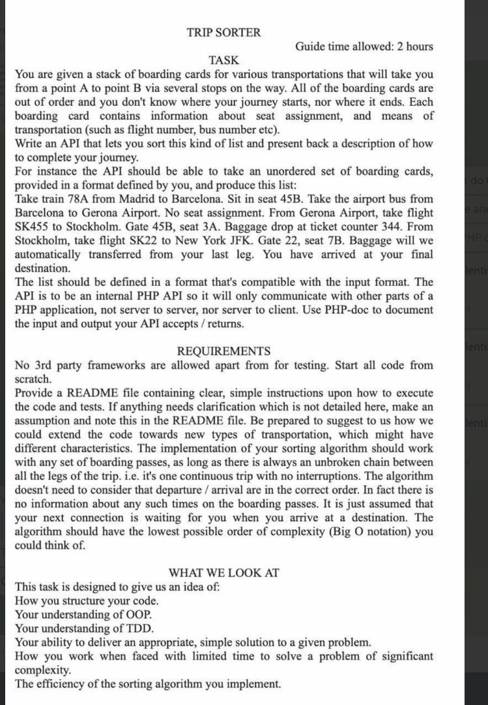

# TRIP SORTER

---

TASK
---


PREPARATION
--- 

### 1. Clone project

> git clone https://github.com/BesedinSasha/TripSorter

### 2. install docker with docker-compose

USAGE
---

```php
        // use unsorted list of boarding cards in plain text format
        $inputString = 'From Gerona Airport, take flight SK455 to Stockholm. Gate 45B, seat 3A. Baggage drop at ticket counter 344.' .
            ' Take train 78A from Madrid to Barcelona. Sit in seat 45B.' .
            ' From Stockholm, take flight SK22 to New York JFK. Gate 22, seat 7B. Baggage will we automatically transferred from your last leg.' .
            ' Take the airport bus from Barcelona to Gerona Airport. No seat assignment';

        // To parse your boarding cards from plain text format use PlainTextInput service. As a dependency use parsers for our models that you want to parse
        $plainTextInput = new PlaintTextInput(
            new TrainBoardingCardParser(),
            new BusBoardingCardParser(),
            new FlightBoardingCardParser()
        );
        // parse text to list of models
        $list = $plainTextInput->parse($inputString);

        // to sort list use TripSorter service
        $tripSorter = new TripSorter();
        // pass unsorted list of boarding cards to sort and receive sorted list
        $sortedList = $tripSorter->sort($list);

        // To output list as plain text use PlainTextOutput. As dependencies use formatters you want to format your models
        $plainTextOutput = new PlainTextOutput(new TrainBoardingCardFormatter(), new BusBoardingCardFormatter(), new FlightBoardingCardFormatter());
        $formattedOutput = $plainTextOutput->format(...$sortedList); // returns formatted list compatible with input format 
```

TESTS
---

To run tests run command

> docker-compose run --rm php composer tests

DEVELOPMENT
---

### Extending

You can create custom input and output. 
You need to implement  `TripSorter\Input\Input` and `TripSorter\Output\Output` interfaces.  

If you want to create boarding cards with new transport type you can extend `TripSorter\Model\AbstractBoardingCard` 
with specific properties. For parsing and formatting you should create parsers and formatters if needed.

### Code styles

Fix code styles

> docker-compose run --rm php composer cs-fix

